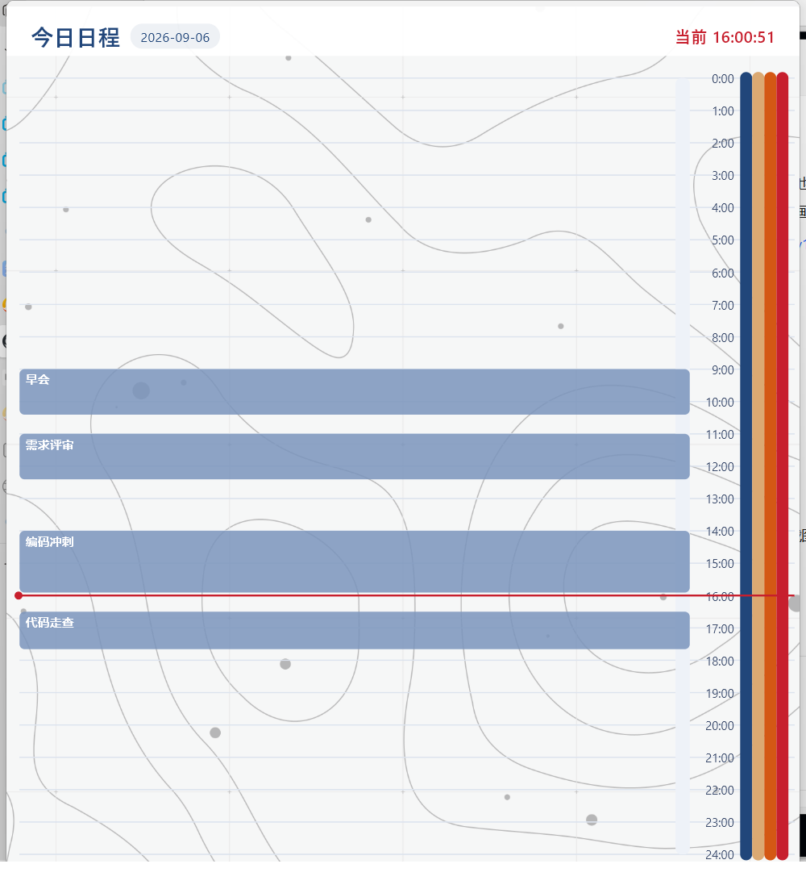

# Timeline 悬浮时间线

一款基于 Flutter 的 Windows 悬浮时间线小工具：无边框置顶窗口，右侧一条纵向时间轴（0-24 时），可自定义任务的名称、详情与起止时间，顶部有随当前时间流动的红色指针。

## 功能特性

- **无边框窗口**：隐藏最小化 / 最大化 / 关闭标题栏，干干净净只显示内容
- **窗口置顶**：设置页可一键开启 / 关闭置顶
- **任意拖动**：主界面按住任意处即可拖动窗口，设置页顶部色条也可拖动
- **纵向时间轴**：时间范围 0:00-24:00，可自定义起始 / 结束显示范围
- **任务管理**：新增、编辑、删除任务，可填写任务名称与任务详情
- **自动保存**：编辑即时同步，退出后重启仍保留；窗口大小也会记忆
- **红色时间指针**：每秒随当前时间移动，始终显示在最上层

## 界面预览



## 操作说明

- **右键**：进入设置页；设置页内右键任意处返回首页
- **设置页**：
  - 时间线显示范围（起始 / 结束，支持到 24:00 表示次日零点）
  - 窗口置顶开关
  - 新增任务、编辑任务详情、删除任务（垃圾桶图标）

## 运行环境

- Windows 10 / 11（64 位）
- 需要 Microsoft Visual C++ 运行库（一般系统自带，或首次运行时按提示安装）

## 下载

前往 [Releases](https://github.com/Lanty17/timeline/releases) 下载 `timeline-windows-x64.zip`，解压后运行 `timeline.exe` 即可。

## 从源码构建

```bash
flutter pub get
flutter build windows --release
```

构建产物位于 `build/windows/x64/runner/Release/`。